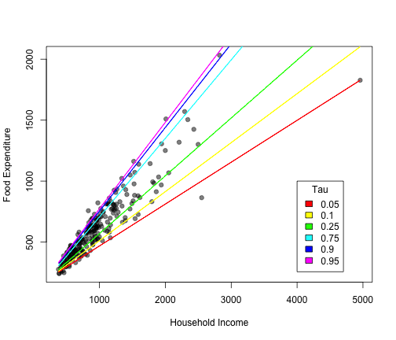

quantRegLines
========================================================

This is an R function to plot multiple quantile regression lines at different levels of tau. It's adapted from the rq helpfile.


```r
source("./quantRegLines.R")
```

```
## Loading required package: quantreg
## Loading required package: SparseM
## 
## Attaching package: 'SparseM'
## 
## The following object is masked from 'package:base':
## 
##     backsolve
```

```r

library(scales)
data(engel)
attach(engel)

taus <- c(0.05, 0.1, 0.25, 0.75, 0.9, 0.95)
plot(income, foodexp, xlab = "Household Income", ylab = "Food Expenditure", 
    pch = 19, col = alpha("black", 0.5))

rq_fit <- rq((foodexp) ~ (income), tau = taus)

quantRegLines(rq_fit)
```

 


Or try it with multiple colors


```r
plot(income, foodexp, xlab = "Household Income", ylab = "Food Expenditure", 
    pch = 19, col = alpha("black", 0.5))

quantRegLines(rq_fit, rainbow(6))
legend(4000, 1000, taus, rainbow(6), title = "Tau")
```

 

